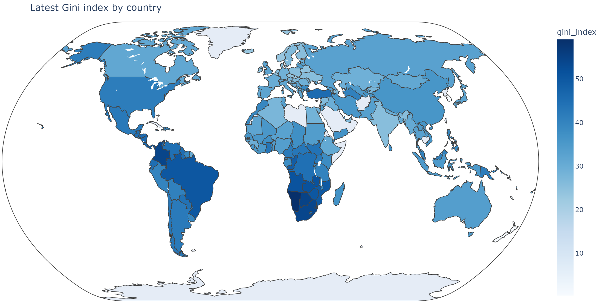
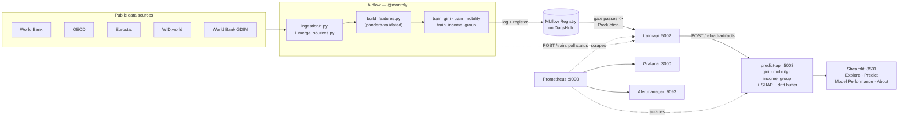

# Income Inequality MLOps Platform

[](https://github.com/zz75da/income-inequality-mlops/actions/workflows/ci.yml)
[](LICENSE)

**Author:** [zz75da](https://github.com/zz75da)

End-to-end MLOps platform predicting country-level income inequality from public macroeconomic data.
FastAPI microservices, Airflow orchestration, DVC/DagsHub data+model versioning, MLflow experiment
tracking with registry-gated model promotion, and Prometheus/Grafana monitoring — scoped for a
tabular, low-QPS, periodically-refreshed dataset rather than a high-throughput production simulation.

## Live Demo

**[income-inequality-mlops-zz75da.streamlit.app](https://income-inequality-mlops-zz75da.streamlit.app/)** —
Streamlit Cloud frontend, calling a predict-api instance hosted on Render's free tier.

> [!WARNING]
> The predict-api backend is on Render's free tier, which spins the service down after ~15 minutes
> of inactivity. The first prediction request after idle time can take **up to ~60 seconds** to
> wake it back up — the Predict page shows a spinner and waits it out rather than erroring, so if
> a prediction seems stuck, give it a minute before assuming it's broken. Explore, Model
> Performance, and About don't call predict-api and load instantly regardless.

## Table of Contents

- [Live Demo](#live-demo)
- [Results](#results)
- [Prediction Targets](#prediction-targets)
- [Data Sources](#data-sources)
- [Architecture](#architecture)
- [Design Scope](#design-scope)
- [Quick Start](#quick-start)
- [Service Endpoints](#service-endpoints)
- [Repository Structure](#repository-structure)
- [Environment Variables](#environment-variables)
- [Engineering Hygiene](#engineering-hygiene)
- [Challenges Solved](#challenges-solved)
- [Known Limitations](#known-limitations)

---

## Results

Current metrics from the live pipeline (`data/artifacts/metrics_*.json`), and whether each model
clears its MLflow registry promotion gate (`params.yaml`'s `promotion_gates`, mirrored in
`monitoring/alert-rules.yml`):

| Target | Metric | Value | Gate | Registry stage |
|---|---|---|---|---|
| Gini index | R² | 0.565 | ≥ 0.4 | ✅ Production |
| Mobility (intergen. elasticity) | R² | 0.339 | ≥ 0.15 | ✅ Production |
| Income group | Accuracy | 0.991 | ≥ 0.7 | ✅ Production |

All three currently clear their gates and are registered as `Production` versions on DagsHub's
MLflow registry — but the gate is real, not decorative: a model that doesn't clear its threshold
stays in `Staging` (still trained, logged, and registered — just not served as the "current"
version) rather than being rubber-stamped into production. See the Streamlit app's Model
Performance page for live status, or `GET /models/registry-status` on predict-api.



## Prediction Targets

Three models, trained from the same country-year feature panel:

| Target | Type | Model | Column |
|---|---|---|---|
| Gini index | Regression | XGBoost | `gini_index` |
| Intergenerational income mobility | Regression | Random Forest | `intergen_income_elasticity` |
| Income-group bracket | Classification (4 classes) | XGBoost | `income_group` |

The third target substitutes the World Bank's Low/Lower-middle/Upper-middle/High income
classification for a genuine household income-bracket model — see
[Known Limitations](#known-limitations) for why.

## Data Sources

All five ingestion scripts hit public, unauthenticated REST/bulk-download endpoints — no paid API
keys required (WID.world's public endpoint is currently retired — see Known Limitations):

| Source | What it provides | Access |
|---|---|---|
| [World Bank Open Data](https://api.worldbank.org/v2/) | Gini index, GDP, unemployment, education/tax/social spending, income-group classification | Public REST API |
| [OECD Income Distribution Database](https://data-explorer.oecd.org/vis?fs[0]=Topic,1%7CSociety%23SOC%23%7CInequality%23SOC_INE%23&df[id]=DSD_WISE_IDD%40DF_IDD) | Gini index (OECD member countries, alternate methodology) | Public SDMX API |
| [WID.world](https://wid.world/data/) | Top-10% / bottom-50% pre-tax income shares | Public REST API (currently retired — best-effort, see limitations) |
| [Eurostat EU-SILC](https://ec.europa.eu/eurostat/web/microdata/collections-research/european-union-statistics-on-income-and-living-conditions) | Gini, S80/S20 ratio, at-risk-of-poverty rate (aggregate indicators only — see limitations) | Public JSON-stat API |
| World Bank GDIM | Intergenerational mobility (education-based proxy) | Public file download (data catalog, no auth) |

`ingestion/*.py` each document their exact request shape; `ingestion/merge_sources.py` joins
them into one country-year panel, coalescing the three Gini variants (World Bank > OECD >
Eurostat priority) into a single `gini_index` column.

## Architecture



MLflow experiment tracking + model registry runs on DagsHub, not as a local container. DVC
versions `data/raw` and `data/artifacts` against the same DagsHub S3-compatible remote.

## Design Scope

This project's data is a few thousand country-year rows of tabular macro indicators, refreshed
on each source's own annual/biennial release calendar — a fundamentally different shape from a
high-throughput, high-QPS production workload, and the stack is scoped accordingly rather than
over-built:

- **Kept deliberately simple:** one feature table feeds three sklearn/XGBoost models — no
  multi-model fan-out, no GPU-bound encoders, no auth gateway (single-tenant demo scope).
- **Full MLOps surface anyway:** DVC + DagsHub, MLflow tracking, FastAPI train-api/predict-api
  split, Airflow orchestration, Docker Compose, Prometheus/Grafana/Alertmanager, pytest
  unit+integration suites, GitHub Actions CI — none of that gets cut just because the data is small.
- **Cadence matches the data, not a generic default:** Airflow runs `@monthly` instead of
  on-demand, matching how often the underlying sources actually publish new figures; Evidently
  drift monitoring watches macro-feature drift rather than prediction-confidence drift, since
  that's the more meaningful signal for a slowly-refreshed macro panel.

## Quick Start

### 1 — Clone and configure

```bash
git clone https://github.com/zz75da/income-inequality-mlops.git
cd income-inequality-mlops
cp .env.template .env       # fill in DAGSHUB_USER, DAGSHUB_TOKEN
dvc init                    # if not already committed
dvc remote modify origin --local access_key_id "$DAGSHUB_TOKEN"
dvc remote modify origin --local secret_access_key "$DAGSHUB_TOKEN"
```

### 2 — Pull raw data (first run: ingest from scratch instead)

```bash
pip install -r requirements.txt
make ingest        # calls all 5 ingest_*.py scripts + merge_sources.py
make features       # build_features.py
# or, once data/raw is DVC-tracked from a previous run:
dvc pull
```

### 3 — Train locally (optional — otherwise train-api does this)

```bash
make dvc-repro      # runs the full DVC pipeline: ingest -> merge -> features -> train x3
```

### 4 — Start the stack

```bash
docker compose build
docker compose up -d
docker compose ps
curl http://localhost:5002/health   # train-api
curl http://localhost:5003/health   # predict-api
```

### 5 — Trigger training via the API (alternative to step 3)

```bash
curl -X POST http://localhost:5002/train -H "Content-Type: application/json" \
  -d '{"target": "all", "run_ingestion": true}'
curl http://localhost:5002/train/status/<job_id>
```

Or open `http://localhost:8080`, enable `income_inequality_pipeline`, and trigger it manually.

## Service Endpoints

### train-api — Training

```
POST /train              {"target": "gini|mobility|income_group|all", "run_ingestion": bool}
                          -> 202 {"job_id": "...", "status": "running"} | 409 if busy
GET  /train/status/{id}  -> {"status": "success|partial_success|running|failed", "log": [...]}
                          partial_success = some targets trained even though others failed
                          (e.g. mobility with no GDIM data) — not treated as a total failure
GET  /health
GET  /metrics
```

Each successful `train_*.py` run also registers its model on the MLflow registry and promotes it
to `Production` if it clears `params.yaml`'s `promotion_gates` (otherwise `Staging`), and pushes
`model_final_r2`/`model_final_accuracy` to Pushgateway for `monitoring/alert-rules.yml`'s alerts.

### predict-api — Inference

```
POST /predict-gini            {feature fields...} -> {"gini_index": float, "interval_80pct": [lo, hi]}
POST /predict-mobility        {feature fields...} -> {"intergen_income_elasticity": float, "interval_80pct": [lo, hi]}
POST /predict-income-group    {feature fields...} -> {"income_group": str, "probabilities": {...}}
POST /explain-gini            {feature fields...} -> {"contributions": {feature: shap_value, ...}}
POST /explain-mobility        {feature fields...} -> {"contributions": {...}}
POST /explain-income-group    {feature fields...} -> {"contributions": {...}, "explained_class": str}
POST /reload-artifacts        (reload models after a training run)
GET  /drift-status
POST /drift-trigger-report
GET  /models/registry-status  (MLflow registry stage/version per target, read from a local file —
                                no live mlflow dependency in this service)
GET  /health
GET  /metrics
```

`interval_80pct` is a fixed-width 80% prediction interval from the held-out test set's residual
std at training time — one global band per target, not per-instance heteroscedastic uncertainty.
Omitted numeric feature fields are median-imputed (from `data/artifacts/feature_medians.json`)
rather than left as NaN, since RandomForestRegressor (unlike XGBoost) has no native NaN support.

See `predict-api/app.py`'s `FeaturePayload` for the full list of accepted feature fields
(mirrors `params.yaml`'s `features.numeric_features` / `categorical_features`).

## Repository Structure

```
income-inequality-mlops/
├── ingestion/
│   ├── common.py                    # shared HTTP retry, long-CSV schema helper, iso2_to_iso3
│   ├── ingest_worldbank.py          # World Bank Open Data API
│   ├── ingest_oecd.py               # OECD SDMX API (generic SDMX-JSON flattener)
│   ├── ingest_eurostat.py           # Eurostat JSON-stat API
│   ├── ingest_wid.py                # WID.world API (best-effort — see Known Limitations)
│   ├── ingest_gdim.py               # GDIM (auto-downloads from World Bank data catalog)
│   └── merge_sources.py             # joins all sources -> merged_panel.csv
├── features/
│   ├── schema.py                    # pandera schema — sanity-checks merged_panel.csv
│   └── build_features.py            # validate/clean/impute/encode -> features.csv + artifacts
├── train-api/
│   ├── app.py                       # /train async job runner
│   └── services/
│       ├── common.py                # param/feature loading, group split, MLflow setup,
│       │                             # register_and_promote() (registry + promotion gates)
│       ├── train_gini.py
│       ├── train_mobility.py
│       └── train_income_group.py
├── predict-api/
│   ├── app.py                       # 3-model inference, SHAP explain, drift buffer
│   └── services/
│       ├── drift_monitor.py
│       └── explain.py               # SHAP TreeExplainer wrapper
├── streamlit/app_streamlit.py       # Explore · Predict · Model Performance · About · Drift Reports
├── airflow/dags/income_pipeline_dag.py  # @monthly re-ingest + retrain + reload
├── monitoring/                      # Prometheus, Alertmanager, Grafana dashboards+provisioning
├── tests/                           # unit + integration pytest suites
├── .github/workflows/ci.yml         # lint, security scan, tests, DVC remote status check
├── .pre-commit-config.yaml          # ruff check/format + stock hygiene hooks
├── pyproject.toml                   # [tool.ruff] + [tool.mypy] (scoped to new modules)
├── requirements-dev.txt             # ruff, mypy, pre-commit, pip-audit, shap, kaleido
├── dvc.yaml                         # ingest -> merge -> features (pandera-validated) -> train x3
├── params.yaml                      # hyperparameters, feature list, promotion_gates
└── docker-compose.yml               # postgres, airflow, train-api, predict-api, streamlit,
                                      # prometheus, grafana, alertmanager, pushgateway
```

## Environment Variables

Copy `.env.template` to `.env` — see that file for the full list (DagsHub/MLflow credentials,
Airflow Fernet/secret keys, Grafana admin password, optional WID API key).

## Engineering Hygiene

```bash
make install-dev       # ruff, mypy, pre-commit, pip-audit, shap, kaleido
make lint-ruff          # ruff check .
make format             # ruff format .
make security           # pip-audit across every requirements*.txt
make precommit-install  # wire the hooks above into git commit
```

CI runs `ruff check`/`ruff format --check` and `pip-audit` as independent jobs alongside the test
suite (`.github/workflows/ci.yml`). `[tool.mypy]` in `pyproject.toml` is scoped to the modules
added in this pass (`features/schema.py`, `predict-api/services/explain.py`) rather than a
full-repo retrofit — annotating the ~20 pre-existing untyped files wasn't worth it relative to the
payoff; new modules are written with type hints from the start and checked here.

## Challenges Solved

Real debugging stories from building and hardening this pipeline against live sources, not
tutorial-perfect assumptions:

- **OECD's SDMX-JSON schema drift.** The code assumed the dimension structure lived at
  `data.structure`; the live API actually returns `data.structures[0]` (an array). Caught by
  finally running ingestion against the real endpoint instead of a fixture.
- **WID.world's public API was retired.** Confirmed via live testing (404, no documented public
  replacement) — the site now calls a private, key-gated AWS endpoint. Rather than trying to work
  around an access-controlled private API, `ingest_wid.py` was made best-effort: its failure
  degrades to median-imputed features instead of aborting a training run.
- **A broken `dvc.yaml`.** It used `required: false` on an output — not valid DVC syntax — which
  silently failed schema validation and blocked every single `dvc` command (`add`, `repro`,
  `push`) until this was caught, because no `dvc` command had ever actually been run before.
- **GDIM's real schema was completely different** from the originally-assumed manual-spreadsheet
  approach. Found the actual public World Bank Data Catalog CSV and its real columns (`BETA`/
  `COR`, not `icm_transmission`/`icm_rank`) — unblocked the whole mobility target with an
  automatic download instead of a manual step.
- **Eurostat's country codes weren't ISO3.** `EL` for Greece, `UK` for the UK, plus aggregates
  like `EU27_2020` — silently failing to join against the other three sources' ISO3 keys. A new
  pandera schema-validation step (`features/schema.py`) caught 976 orphaned rows on the first
  real run; fixing the join lifted gini's R² from 0.31 to 0.60.
- **World Bank's own regional aggregates were mixed into the country list.** Rows for "Africa
  Eastern and Southern", "World", etc. have 3-letter codes too, so a naive ISO3-length filter let
  them through as fake "countries" — found while checking the Streamlit country selector during
  the app rebuild, fixed by cross-referencing the API's own `incomeLevel` metadata.
- **A same-named-module test collision.** `train-api/app.py` and `predict-api/app.py` are both
  literally `app.py`; with both directories on `sys.path`, a bare `import app` silently returned
  whichever one was cached first — only reproducible when the full test suite ran together
  (exactly what CI does), which is why it went unnoticed until CI was fixed and actually ran for
  the first time in this project's history.

## Known Limitations

- **WID.world's public REST API (`/api/v3.php`) has been retired** and returns 404 with no
  documented public replacement — the site and official R package now call a private,
  key-gated AWS API Gateway endpoint not obtainable through public signup. `ingest_wid.py` is
  therefore treated as best-effort: its failure doesn't abort a training run, and
  `top10_income_share`/`bottom50_income_share` fall back to median imputation when absent. See
  the script's docstring for details.
- **No true household income-bracket target.** EU-SILC microdata (individual/household rows)
  requires a restricted research-access agreement with Eurostat — it is not available through
  any free API. `income_group` (World Bank's Low/Lower-middle/Upper-middle/High classification)
  is used as the closest legitimately-obtainable "bracket" target instead.
- **GDIM mobility uses an education-based proxy, not true income mobility.** `ingest_gdim.py`
  auto-downloads the public World Bank Data Catalog CSV (no manual step, no auth) and uses its
  `BETA`/`COR` columns (intergenerational persistence/rank-correlation of years-of-schooling) as
  the `intergen_income_elasticity`/`intergen_rank_correlation` features — there's no free dataset
  with this country coverage using actual income. If the dataset's Data Catalog resource id ever
  changes, the script falls back to `data/raw/gdim_manual_download.csv` if present, then degrades
  to an empty output (same best-effort pattern as `ingest_wid.py`) rather than failing the job.
- **World Bank income-group classification is a current snapshot, not a historical series** via
  the API; a true year-by-year series requires manually downloading the OGHIST spreadsheet
  (documented in `ingest_worldbank.py`).
- **`params.yaml`'s `promotion_gates` and `monitoring/alert-rules.yml`'s model-quality thresholds
  are two hand-synced copies of the same numbers**, not one source of truth — Prometheus rule
  files can't read arbitrary YAML, so there's no clean way to derive one from the other without a
  codegen step that felt like overkill for three numbers. Keep both in sync by hand if you change
  either (each file has a comment pointing at the other).
- **`[tool.mypy]` only type-checks the modules added in the portfolio-upgrade pass**
  (`features/schema.py`, `predict-api/services/explain.py`), not the ~20 pre-existing files — a
  full-repo retrofit wasn't worth it relative to the payoff; see Engineering Hygiene above.

---

## Author & License

**Author:** [zz75da](https://github.com/zz75da)

Licensed under the [MIT License](LICENSE) — Copyright © 2026 zz75da.
